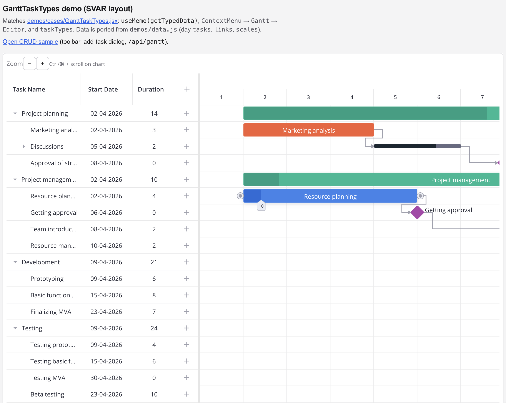
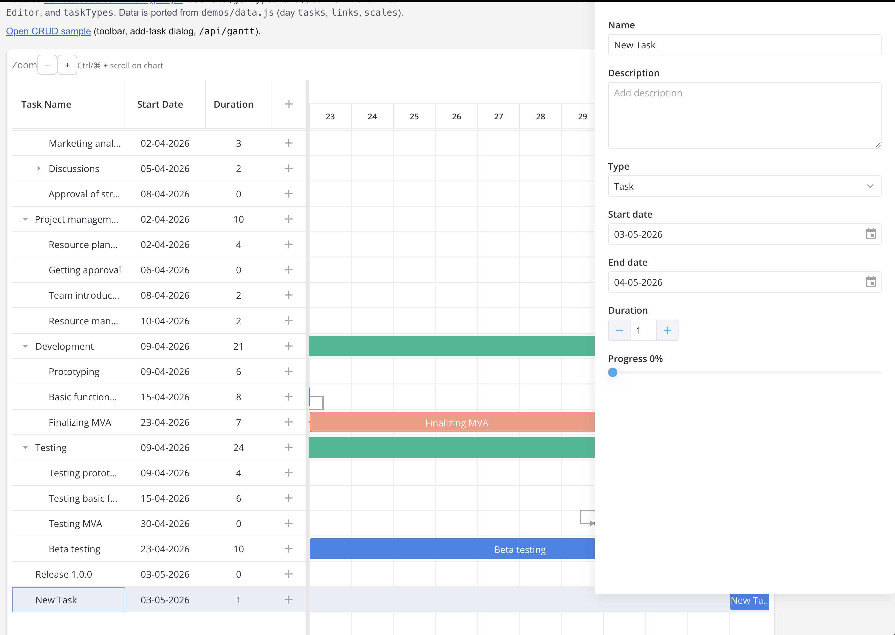

# Sample Gantt charts

Screenshots of the app UI live in [`ss/`](./ss/).

## Samples

### Sample 1



### Sample 2



## Run locally

```bash
npm install
npm run dev
```

Open [http://localhost:3000](http://localhost:3000). The CRUD demo is at `/crud`.
